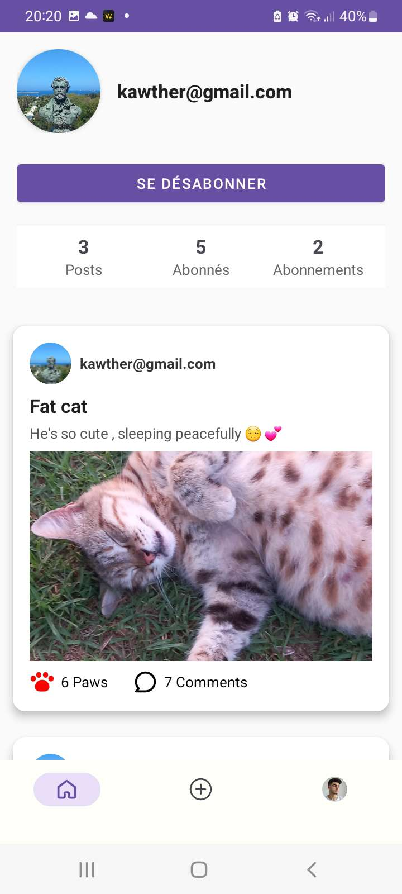
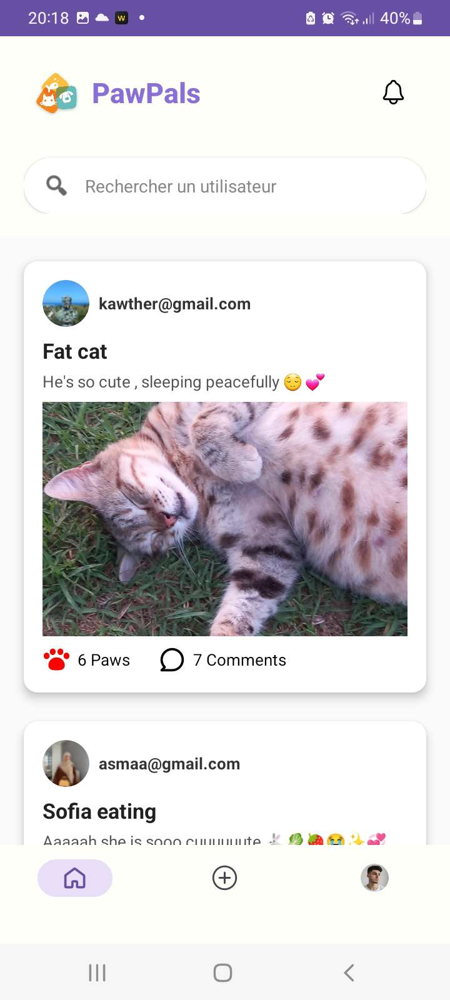
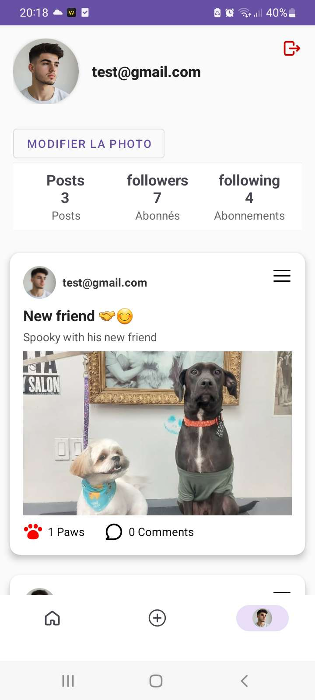
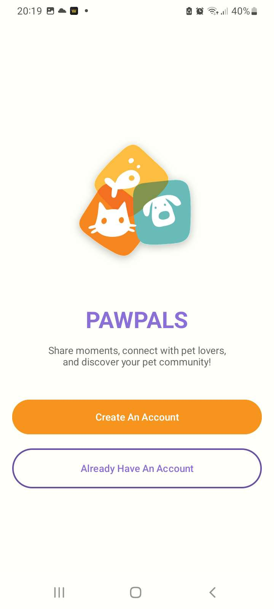
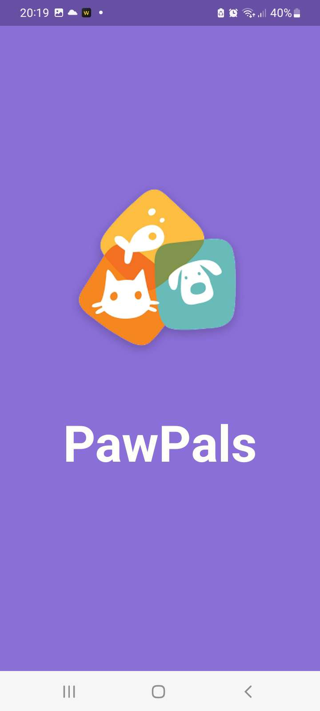

# 🐾 PawPals – Android Social Media App

## 📱 Overview
**PawPals** is a social media Android application designed for animal lovers to share posts,
interact with others, and build a friendly community around pets.

The application is developed using **Kotlin and XML** and relies on **Firebase** for backend
services and **Cloudinary** for efficient image storage and management.

A demo video is available to showcase the main features and user experience.

---

## 🎯 Objectives
- Build a modern Android social media application
- Use cloud-based backend services
- Manage media storage efficiently
- Apply clean UI design with XML layouts

---

## 🛠️ Technologies Used

### 📱 Android
- **Kotlin**
- **XML layouts**
- Android Studio

### ☁️ Backend & Cloud
- **Firebase Authentication**
- **Firebase Firestore / Realtime Database**
- **Cloudinary** (image storage and optimization)

---

## ✨ Features
- User authentication (sign up / login)
- Create and publish posts
- Upload and display images
- View and interact with posts
- Real-time data synchronization
- Clean and user-friendly interface

---

## 🖼️ Media Management
- Images are uploaded and stored using **Cloudinary**
- Optimized image delivery for better performance
- Firebase stores metadata and user information

---

## 🎥 Demo Video
A demo video demonstrating the main features of the application is available here:

👉 **https://drive.google.com/file/d/1Ua6e_NVWu9o3mJyYwlR6CZx3Xu3UPGuj/view?usp=sharing**

---
## 📸 Screenshots

  
  
  

  
  
  

  
  

